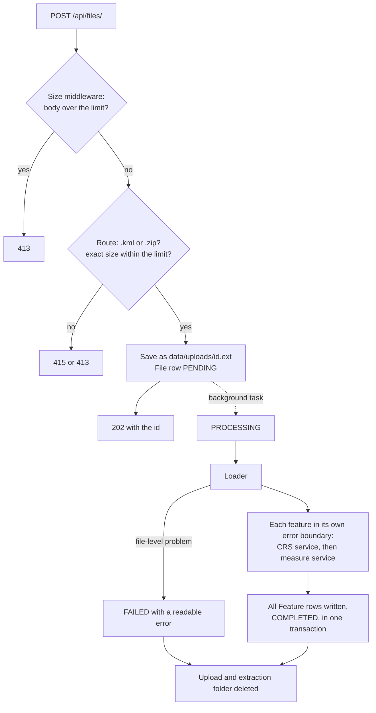

# Meridian

A FastAPI service that accepts a geospatial file (a `.zip` Shapefile or a `.kml`), extracts
every feature, and measures it: **area for polygons, length for lines, nothing for points.**
Built as a backend take-home for Aereo.

The idea behind every design choice: **a measurement that looks plausible but is wrong is
worse than no measurement.** So area and length are never computed on latitude and
longitude degrees. Each feature is projected into the UTM zone of its own centroid and
measured in metres, and a geodesic value computed on the WGS84 ellipsoid is stored beside
it as an independent cross-check. Anything that cannot be measured, or was assumed or
repaired on the way, says so in the response.

**Contents:** [Quick start](#quick-start) · [Sample files](#sample-files) ·
[API](#api) · [Architecture](#architecture) · [CRS handling](#crs-handling) ·
[Design decisions](#design-decisions) · [Testing](#testing) · [Learnings](#learnings) ·
[Limitations and future scope](#limitations-and-future-scope)

## Quick start

Requires Python 3.12, or Docker. Everything runs offline: no API keys, no external
services, no system GDAL (the pyogrio and pyproj wheels bundle GDAL and PROJ).

**With a virtual environment**

```bash
git clone https://github.com/D-Dynamico/Meridian.git
cd Meridian
python3.12 -m venv .venv                       # Windows: py -3.12 -m venv .venv
.venv/bin/python -m pip install -r requirements.txt    # Windows: .venv\Scripts\python
.venv/bin/python -m uvicorn app.main:app
```

**With Docker**

```bash
git clone https://github.com/D-Dynamico/Meridian.git
cd Meridian
docker build -t meridian .
docker run --rm -p 8000:8000 meridian          # add -v meridian-data:/data to keep data
```

Then open **http://127.0.0.1:8000/docs** for the interactive API, where you can upload a
file from `samples/` with "Try it out". Or from a terminal:

```bash
curl -F "file=@samples/survey.kml" http://127.0.0.1:8000/api/files/
curl http://127.0.0.1:8000/api/files/<id>/
curl http://127.0.0.1:8000/api/files/<id>/measurements/
```

On Windows PowerShell 5, type `curl.exe` rather than `curl`, which is an alias for
`Invoke-WebRequest` there.

**Run the tests**

```bash
.venv/bin/python -m pytest -q                                      # 231 tests, about 12 s
docker run --rm meridian python -m pytest -q -p no:cacheprovider   # the same suite on Linux
```

**Configuration** (optional, both have defaults):

| Variable | Default | Meaning |
|---|---|---|
| `MERIDIAN_DATA_DIR` | `data/` (`/data` in Docker) | SQLite database and temporary upload folders |
| `MERIDIAN_MAX_UPLOAD_MB` | `50` | Largest accepted upload |

## Sample files

`samples/` holds two small files, generated by `scripts/make_samples.py`. Their shapes are
built on the ground with `pyproj.Geod.fwd`, so their true areas are known, and
`tests/test_samples.py` checks that the API returns what this table says.

**`samples/survey.kml`**: near Jaipur, three folders, EPSG:4326 (every KML is).

| # | Layer | Feature | What it shows | Result |
|---|---|---|---|---|
| 0 | Parcels | Plot 12, a 1 km by 1 km square | Area after projecting to UTM 43N | 999,314.22 m2 (geodesic 999,960.24) |
| 1 | Parcels | Plot 14, outline crosses itself | Invalid polygon repaired, flagged | 124,917.62 m2, `repaired: true` |
| 2 | Roads | Access road, 1 km | Length | 999.68 m (geodesic 1,000.00) |
| 3 | Roads | Site gate | Points are not measured | `measurement: null` with a note |
| 4 | Reference | A point and a line in one `MultiGeometry` | Unsupported type, no error | `measurement: null` with a note |

**`samples/parcels.zip`**: three parcels near Bengaluru of 1, 3 and 5 hectares, stored in
EPSG:32643 (UTM zone 43N) with a `.prj`. Already in UTM, so measured in place with no
transform: 10,011.53, 30,034.63 and 50,057.84 m2.

Both files show the projected value and the geodesic value disagreeing by a small, known
amount. That gap is the UTM scale factor, not an error, and is explained under
[CRS handling](#crs-handling).

## API

| Method | Path | Purpose | Success |
|---|---|---|---|
| POST | `/api/files/` | Upload a file; processing starts in the background | 202 |
| GET | `/api/files/{id}/` | File information, status and summary | 200 |
| GET | `/api/files/{id}/measurements/` | Per-feature measurements, paged | 200 |
| GET | `/api/files/` | List uploads, newest first (extra) | 200 |
| GET | `/health` | Liveness check (extra) | 200 |

The first three are the brief's. Paths are also served without the trailing slash. The
full reference, including every error message, is [`docs/API.md`](docs/API.md). The
examples below are real responses for `samples/survey.kml`.

### Upload

```bash
curl -F "file=@samples/survey.kml" http://127.0.0.1:8000/api/files/
```

```json
{
  "id": "474546b6-4620-46a5-acfd-a4cebff0eaa8",
  "filename": "survey.kml",
  "status": "PENDING"
}
```

The response is 202 as soon as the file is saved. Status then moves from `PENDING` to
`PROCESSING` to `COMPLETED` or `FAILED`; the samples take well under a second.

### File information

```bash
curl http://127.0.0.1:8000/api/files/474546b6-4620-46a5-acfd-a4cebff0eaa8/
```

```json
{
  "id": "474546b6-4620-46a5-acfd-a4cebff0eaa8",
  "filename": "survey.kml",
  "format": "KML",
  "feature_count": 5,
  "crs": "EPSG:4326",
  "crs_assumed": false,
  "status": "COMPLETED",
  "error": null,
  "created_at": "2026-10-06T21:45:39.882893Z",
  "completed_at": "2026-10-06T21:45:40.037748Z",
  "summary": {
    "by_type": { "GeometryCollection": 1, "LineString": 1, "Point": 1, "Polygon": 2 },
    "total_area_m2": 1124231.85,
    "total_area_ha": 112.4232,
    "total_length_m": 999.68,
    "total_length_km": 0.9997
  }
}
```

`summary` is null until the file is `COMPLETED`. A `FAILED` file carries the reason in
`error`, for example `"Shapefile 'parcels' is missing .shx and .dbf"`. `crs` is `MIXED`
when a zip holds shapefiles in different CRSs, and `crs_assumed` is true when a `.prj` was
missing and EPSG:4326 was inferred.

### Measurements

```bash
curl "http://127.0.0.1:8000/api/files/474546b6-4620-46a5-acfd-a4cebff0eaa8/measurements/?limit=2&offset=2"
```

```json
{
  "file_id": "474546b6-4620-46a5-acfd-a4cebff0eaa8",
  "count": 5,
  "limit": 2,
  "offset": 2,
  "results": [
    {
      "index": 2,
      "layer": "Roads",
      "geometry_type": "LineString",
      "source_crs": "EPSG:4326",
      "measurement_method": "projected",
      "measurement_crs": "EPSG:32643",
      "measurement": { "type": "length", "value": 999.68, "unit": "m", "km": 0.9997 },
      "geodesic_value": 1000.0,
      "repaired": false,
      "note": null,
      "properties": { "Name": "Access road", "surface": "gravel" },
      "geometry": {
        "type": "LineString",
        "coordinates": [[75.79, 26.91], [75.79, 26.919025093445534]]
      }
    },
    {
      "index": 3,
      "layer": "Roads",
      "geometry_type": "Point",
      "source_crs": "EPSG:4326",
      "measurement_method": null,
      "measurement_crs": null,
      "measurement": null,
      "geodesic_value": null,
      "repaired": false,
      "note": "No measurement for point geometries",
      "properties": { "Name": "Site gate", "surface": null },
      "geometry": { "type": "Point", "coordinates": [75.79035592561509, 26.910319084987027] }
    }
  ]
}
```

A repaired polygon from the same file, requested with `include_geometry=false`:

```json
{
  "index": 1,
  "layer": "Parcels",
  "geometry_type": "Polygon",
  "source_crs": "EPSG:4326",
  "measurement_method": "projected",
  "measurement_crs": "EPSG:32643",
  "measurement": { "type": "area", "value": 124917.62, "unit": "m2", "hectares": 12.4918 },
  "geodesic_value": 124997.51,
  "repaired": true,
  "note": "Repaired invalid geometry",
  "properties": { "Name": "Plot 14", "owner": "R. Meena", "survey_no": "114/1" }
}
```

Query parameters: `limit` (default 100, at most 1000), `offset`, `geometry_type` (for
example `Polygon`) and `include_geometry` (default true).

How to read a result:

- Every result carries every field, with null where there is no value.
- `measurement.value` is in `m2` or `m`, the canonical units. `hectares` or `km` is a
  convenience field beside it, never a replacement.
- `measurement_method` is `projected` (measured in `measurement_crs`, a UTM zone) or
  `geodesic` (only beyond UTM's latitude limits). It is never inferred from a null.
- `geodesic_value` is the ellipsoidal cross-check, always present on a measured feature.
- `geometry` is GeoJSON in the source CRS, as read from the file.
- `note` explains anything assumed, repaired, ignored or not measured. Several notes are
  joined with `"; "`, for example `"CRS assumed EPSG:4326 (no .prj); repaired invalid
  geometry"`.

### Errors

Every error has the shape `{"detail": "<reason>"}`.

| Case | Code | Detail |
|---|---|---|
| Unsupported extension | 415 | Only .kml and .zip files are supported |
| File too large | 413 | Maximum upload size is 50 MB |
| Unknown file id | 404 | File not found |
| Measurements before completion | 409 | File is still PROCESSING |
| Measurements for a failed file | 409 | File processing FAILED: Shapefile 'parcels' is missing .shx and .dbf |

A broken file does not fail the upload request. Problems inside the file (corrupt zip,
missing parts, malformed KML) surface as `status: FAILED` with a readable `error`, and
never contain server paths or exception internals.

## Architecture

```
app/
  main.py              App factory and composition root: wires the real processor in
  api/files.py         Routes only: validation, database reads. No geospatial imports
  api/upload_limit.py  ASGI middleware that rejects oversized bodies before parsing
  api/deps.py          Settings, database session and processor dependencies
  core/config.py       Limits, allowed extensions, storage paths
  db/                  SQLModel tables (File, Feature), engine, read queries
  schemas/files.py     Pydantic response models
  services/
    loader.py          Safe zip extraction, KML layers, plain Python features out
    properties.py      Attribute values to JSON-safe Python (NaN, numpy, dates)
    crs.py             Source CRS, UTM zone choice, cached transformers
    measure.py         Area, length, repair, notes, geodesic cross-check
    processor.py       Runs loader, CRS and measure per file; status transitions
tests/                 231 tests, inputs built in code
scripts/               Sample generator and the mutation-check runner
samples/               Files to upload straight away
docs/                  Design docs and dated session notes
```

**Routes contain no geospatial logic.** GeoPandas, Shapely and pyproj are imported only
under `app/services/`, and a test enforces it by importing the routes in a clean
subprocess. The upload route does not even import the processor: it receives it through
`Depends(get_processor)`, and `main.py` wires the real one. That keeps the services
testable without HTTP and lets the tests swap in a no-op or a synchronous processor.

### File-processing flow



1. **Upload.** A middleware rejects a body over the limit before FastAPI reads it (FastAPI
   parses the whole multipart body before any handler runs, so a check in the route
   alone would only fire after a 2 GB upload had been received). The route checks the
   extension and exact size, stores the file under its id, never the client's name, and
   returns 202.
2. **Loading.** For a zip: reject any entry path that could escape the folder (zip slip),
   refuse a zip declaring more than 500 MB uncompressed, ignore macOS metadata, match
   extensions case-insensitively, require `.shp`, `.shx` and `.dbf` for every shapefile,
   and read each shapefile as its own layer with its own CRS. For a KML: list every layer
   and read each one, keeping the folder name per feature. Attribute values are made
   JSON-safe, so no NaN or numpy value reaches the database.
3. **Measuring.** Each feature goes through the CRS and measure services inside its own
   error boundary. One bad feature records a note and the loop continues; only a
   file-level problem marks the file `FAILED`.
4. **Recording.** All rows are written and the file marked `COMPLETED` in one transaction,
   so a failed file never keeps partial results. The upload is deleted in a `finally`
   block. On startup, any file left `PENDING` or `PROCESSING` by a stopped server is
   marked `FAILED` with a message to upload it again, instead of showing `PROCESSING`
   forever.

The read endpoints only ever touch the database.

### Measurement flow, per feature

| Geometry | Result |
|---|---|
| Empty or missing | No measurement, note "Empty geometry" |
| Point, MultiPoint | No measurement, note "No measurement for point geometries" |
| Polygon, MultiPolygon | Area in m2 after projecting; geodesic area beside it |
| Invalid polygon | `make_valid`, keep only polygonal parts, measure, `repaired: true` |
| Polygon with no real area | No measurement, note "Degenerate polygon", never measured as a length |
| LineString, MultiLineString | Length in m after projecting; geodesic length beside it |
| GeometryCollection, anything else | No measurement, note "Unsupported geometry type" |
| Centroid beyond 84°N or 80°S | Geodesic value, `measurement_method: geodesic`, note |
| Z coordinates | Measured in 2D; noted only when some Z is non-zero |

Unsupported is an answer, not an error: nothing in this table raises.

## CRS handling

This is the part a mapping team will check first, so every rule is listed here and
explained in full in [`docs/CRS.md`](docs/CRS.md).

**Why degrees fail.** Shapely does flat-plane maths. On EPSG:4326 coordinates, `.area`
returns square degrees, and a degree of longitude is about 111 km at the equator, 100 km
at Jaipur's latitude and zero at the poles. No single conversion factor exists.

**The rule, per feature:**

1. **Find the source CRS.** From each shapefile's `.prj` (a zip may hold several, in
   different CRSs). KML is always EPSG:4326.
2. **Already UTM?** Measure in place. This is the only CRS measured without a transform.
3. **Anything else**, geographic or projected, goes to the UTM zone of the feature's own
   centroid: zone `floor((lon + 180) / 6) + 1`, EPSG 326xx north of the equator and 327xx
   south. Even a projected CRS in metres is not trusted: Web Mercator (EPSG:3857) is in
   metres and overstates area by 22.3 percent at 25°N.
4. **Measure** area or length in metres.
5. **Cross-check** with `pyproj.Geod` on the WGS84 ellipsoid, from lon/lat, with polygon
   rings oriented first. Both values are stored.

The zone is chosen per feature, not per file, so a file spanning several zones measures
each feature in its own. Transformers are built with `always_xy=True` (lon, lat order,
always) and cached per CRS pair.

**Missing `.prj`.** If every coordinate fits within ±180 and ±90, EPSG:4326 is assumed,
reported as the CRS, and flagged with `crs_assumed: true` and a note on every feature.
Otherwise the features are not measured. A missing `.prj` is never silently treated as
EPSG:4326.

**Why projected and geodesic differ, and by how much.** UTM scales distances by 0.9996 on
the zone's central meridian and by slightly more away from it, so area error is about
twice the scale error. The gap is predictable from the formula
`k = 0.9996 * (1 + (dlon * cos(lat))^2 / 2)`:

| Location | Projected against geodesic area |
|---|---|
| Jaipur, 0.8° from the central meridian (`survey.kml`) | -0.065% |
| Central meridian, on the equator | -0.080% |
| Bengaluru, 2.6° from the central meridian (`parcels.zip`) | +0.116% |
| Zone edge, on the equator | +0.195% |

The formula predicted every measured gap to within 0.0022 percent. The tests use it: a
feature projected into the neighbouring zone can still land within a quarter of a
percent of the geodesic value, but it cannot match the formula.

## Design decisions

Condensed from [`docs/DECISIONS.md`](docs/DECISIONS.md), which also lists the
alternatives considered for each.

| Decision | Choice | Why |
|---|---|---|
| Framework | FastAPI | Three endpoints need typed models and an OpenAPI page, not Django's admin and ORM |
| Projection | UTM zone of each feature's centroid | Standard in survey work, metre-based, bounded and well-understood distortion, easy to verify |
| Measured in place | Only UTM | "Projected and in metres" would let Web Mercator through at +22.3% area |
| Cross-check | Geodesic value stored beside every projected value | Catches wrong zones and swapped axes; answers "how do you know the number is right?" |
| Geodesic sign | Orient rings, then measure | `abs()` measured a MultiPolygon with opposite-wound parts as 0 |
| Invalid polygons | Repair with `make_valid`, keep polygon parts, flag | Field data is often slightly invalid; the flag keeps the result honest |
| Missing `.prj` | Infer EPSG:4326 only when coordinates fit, and flag it | Rejecting loses data; assuming silently hides risk |
| Layers | Read every layer, keep its name | GeoPandas reads only the first KML layer by default |
| Processing | FastAPI `BackgroundTasks` | Fast uploads and a meaningful status, with no broker to run |
| Storage | SQLite via SQLModel; geometry as GeoJSON text | Zero setup for reviewers; PostGIS is the production path |
| Size limit | ASGI middleware plus an exact check in the route | FastAPI reads the whole body before any route code runs |
| Route to processor | Dependency injection, wired in `main.py` | Routes never import geospatial code, and tests never race a background task |
| Units | m2 and m canonical, hectares and km alongside | Hectares are how parcels are discussed; base units stay unambiguous |
| Blocking work | Plain `def` handlers and background work | GeoPandas and pyproj are CPU-bound and would block the event loop |

## Testing

```bash
.venv/bin/python -m pytest -q
```

231 tests, offline, in about 12 seconds. Every input is built in code, so each expected
value is visible in the test that uses it. The ones that matter most:

- **Accuracy fixtures built on the ground.** Squares and lines are walked out with
  `Geod.fwd` in lon/lat. A square drawn in UTM coordinates and measured in the same zone
  always comes out at exactly 1,000,000 m2, so it would pass with the CRS code deleted.
- **Location-aware tolerances.** Projected and geodesic must agree within 0.25 percent for
  area and 0.15 percent for length, and the gap must match the UTM scale-factor formula
  within 0.005 percent, which a wrong zone fails.
- **The EPSG code, not only the area.** A square at 56°N and the same square at 56°S
  measure identically, so a hemisphere bug only shows in the code.
- **End to end** for both formats through the API with the real processor, including the
  sample files.

**Mutation checks.** A test that cannot fail protects nothing.
`scripts/mutation_check.py` applies 88 deliberate bugs one at a time (skip the transform,
swap lon and lat, read only the first KML layer, drop the zip-slip check, and so on) and
confirms that each turns a test red. All 88 are caught. Several real gaps were found this
way; see [Learnings](#learnings).

```bash
.venv/bin/python scripts/mutation_check.py --check   # patterns still match, seconds
.venv/bin/python scripts/mutation_check.py           # every mutation, about 10 minutes
```

## Learnings

Each of these was found by probing the real libraries or by a mutation check, not
assumed. The dated notes in [`docs/sessions/`](docs/sessions/) have the full detail.

**Geospatial**

- **`abs()` on a geodesic area is not enough.** `Geod` signs area by ring orientation, and
  shapefile exteriors are clockwise. Taking `abs()` fixes the overall sign only: a
  MultiPolygon with one part each way measured 0, and a hole wound like its exterior was
  added instead of subtracted (1,039,960 m2 instead of 959,961 m2). Rings are now
  oriented first.
- **A valid polygon can have no area.** Shapely accepts a collinear polygon, so
  `make_valid` never runs, and its area in degrees is floating-point dust rather than 0.
  Transformed, a 3 km sliver gained 139 m2 of artificial area, because a line straight
  in lon/lat is curved in UTM. "No area" is now judged by a unitless ratio in the source
  CRS.
- **`make_valid` can return lines.** A polygon that doubles back on itself repairs to a
  MultiLineString, which a naive dispatcher would have measured as a length.
- **The planned accuracy tolerance would have failed correct code.** A 0.1 percent band
  held only because the first fixture sat near its zone's central meridian. Bengaluru
  sits at +0.116 percent and a zone edge at +0.195 percent.
- **Measuring UTM in place keeps UTM's distortion.** The Bengaluru parcels, stored in
  UTM, report 0.116 percent more area than the ground. Skipping the transform saves work;
  it does not make the number truer. The geodesic value is the closer answer.
- **GDAL is more forgiving than the brief.** It reads a shapefile with no `.dbf` and
  silently returns no attributes, so the loader's own required-part check is what keeps
  "every feature reports its properties" true.
- **KML through LIBKML carries display defaults.** Every feature gets `tessellate`,
  `extrude` and `visibility` filled in even when the file has none, so they cannot be
  told apart from real values and are dropped. Nested folders come back as flat layers,
  and a KML with no placemarks has zero layers, which made GeoPandas' default read crash
  with a bare `IndexError`.

**Python and FastAPI**

- **Invalid JSON can hide in the database.** pandas 3 reports missing values as float
  NaN, and `json.dumps` writes NaN by default, which is not valid JSON. Responses looked
  fine because Pydantic turns NaN into null on the way out; only the stored text showed
  the damage. Attributes are now cleaned in the loader, and a test checks the stored text
  with SQLite's `json_valid`.
- **`numpy.float64` is a subclass of `float`.** A cleaning function that checked plain
  types first let numpy scalars through untouched.
- **A size check in a FastAPI route comes too late.** The multipart body is fully
  received and parsed before any dependency runs. The limit had to move into ASGI
  middleware, and it must raise `HTTPException`: anything else is turned into a generic
  400.
- **Some code could never run.** Byte counting during zip extraction (Python's zipfile
  never yields more than an entry declares, and an understated size fails its CRC), a
  fallback that GDAL makes unreachable, and a Z-stripping step for operations that are
  already 2D. Each was found because its mutation stayed green, and each was removed.

**Tests that could not fail**

- A `.gitattributes` test passed with the `*.shp` rule deleted, because Windows ignores
  case and `*.SHP` matched instead. It now forces case sensitivity, as on Linux.
- Disconnecting the size middleware left every test green, because the route's own check
  also answers 413. Middleware tests now upload an unsupported extension, so a 413 can
  only come from the middleware.
- A backslash zip-slip test did nothing on Windows, where zipfile already converts
  backslashes. It is also tested at the function level now, and the suite runs in the
  Linux container.

## Limitations and future scope

**Known limitations**

- **Very large features.** One UTM zone is a poor fit for a district-sized polygon or one
  that crosses a zone boundary; the zone of the centroid is used. The geodesic value is
  the better answer there, and is always reported.
- **Antimeridian-crossing geometry** is not handled.
- **One server process.** Background tasks live inside it, and startup recovery assumes
  no other worker is mid-processing.
- **Norway and Svalbard UTM exceptions** are not applied; the plain zone is still valid,
  only slightly further from its central meridian.

**Future scope**, deliberately left out of this take-home:

- **Scale:** a durable queue (Celery or RQ with Redis) instead of `BackgroundTasks`,
  PostGIS instead of SQLite, upload limits at a reverse proxy, multiple workers.
- **Measurement:** automatic switch to geodesic or a local equal-area projection for very
  large features, perimeter for polygons, 3D, volume and DEM-based measurement from
  drone surveys.
- **Formats:** GeoJSON, GeoPackage and KMZ (each a small change in the loader, since the
  measurement path is format-agnostic).
- **Product:** authentication and per-user files, a map view, editing, re-projecting and
  downloading processed files.

## Further reading

| Doc | Contents |
|---|---|
| [`docs/ARCHITECTURE.md`](docs/ARCHITECTURE.md) | The brief, scope, module map, data model, both flows, edge cases |
| [`docs/API.md`](docs/API.md) | Full endpoint reference and every error message |
| [`docs/CRS.md`](docs/CRS.md) | Projection strategy, zone selection, accuracy figures, edge cases |
| [`docs/DECISIONS.md`](docs/DECISIONS.md) | 31 decisions with the alternatives considered |
| [`docs/TEST_PLAN.md`](docs/TEST_PLAN.md) | Fixtures, per-module requirements, mutation checks |
| [`docs/WORKFLOWS.md`](docs/WORKFLOWS.md) | Setup, file lifecycle, build stages, definition of done |
| [`docs/sessions/`](docs/sessions/) | Dated notes: what changed, why, and what nearly broke |
