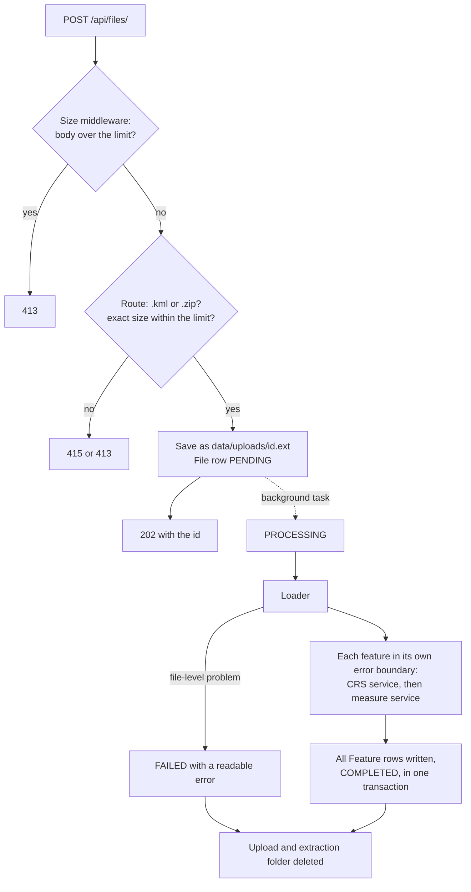

# Meridian

A FastAPI service that accepts a geospatial file (a `.zip` Shapefile or a `.kml`), extracts
every feature, and measures it: **area for polygons, length for lines, nothing for points.**
Built as a backend take-home for Aereo.

The idea behind every design choice: **a measurement that looks plausible but is wrong is
worse than no measurement.** So area and length are never computed on latitude and
longitude degrees. Each feature is projected into the UTM zone of its own centroid and
measured in metres, and a geodesic value computed on the WGS84 ellipsoid is stored beside
it as an independent cross-check. Anything that cannot be measured, or was assumed or
repaired on the way, says so in the response.

**Contents:** [Prerequisites](#prerequisites) · [Quick start](#quick-start) ·
[Sample files](#sample-files) · [API](#api) · [Architecture](#architecture) ·
[CRS handling](#crs-handling) · [Design decisions](#design-decisions) ·
[Testing](#testing) · [Learnings](#learnings) ·
[Limitations and future scope](#limitations-and-future-scope)

## Prerequisites

- **git**.
- **Python 3.12** for the virtual-environment path. Install it from
  [python.org](https://www.python.org/downloads/). On Windows the installer adds the
  `py` launcher, so the command is `py -3.12`; on macOS and Linux it is `python3.12`.
- **Docker Desktop, installed and running**, for the Docker path. `docker info` should
  print server details; if it reports that it cannot connect, start Docker Desktop and
  wait until it says it is running.

Nothing else: no API keys, no external services, and no system GDAL (the pyogrio and
pyproj wheels bundle GDAL and PROJ). Everything runs offline once installed.

## Quick start

```bash
git clone https://github.com/D-Dynamico/Meridian.git
cd Meridian
```

### With a virtual environment

Create and activate the environment with the lines for your shell:

```bash
# macOS / Linux
python3.12 -m venv .venv
source .venv/bin/activate

# Windows PowerShell
py -3.12 -m venv .venv
.venv\Scripts\Activate.ps1

# Windows Git Bash
py -3.12 -m venv .venv
source .venv/Scripts/activate
```

If PowerShell says running scripts is disabled, run
`Set-ExecutionPolicy -Scope Process -ExecutionPolicy RemoteSigned` and activate again. It
only affects that window.

With the environment active, every command is the same in every shell:

```bash
python -m pip install -r requirements-dev.txt   # the app plus the test tools
python -m pytest -q                             # the test suite, offline
python -m uvicorn app.main:app                  # serves http://127.0.0.1:8000
```

### With Docker

```bash
docker build -t meridian .
docker run --rm -p 8000:8000 meridian           # add -v meridian-data:/data to keep data
```

The first build downloads the `python:3.12-slim` base image, about 180 MB.

To run the test suite with nothing installed but Docker, build the separate test image:

```bash
docker build --target test -t meridian-test .
docker run --rm meridian-test
```

The runtime image contains only the app; the test image adds the tests and test tools
(`docs/DECISIONS.md` D33). Inside it, 8 tests that inspect the git checkout are skipped,
because there is no `.git` in the image.

### Try it

Open **http://127.0.0.1:8000/docs** to use the API from the browser ("Try it out"), or
run the reviewer loop from a second terminal in the `Meridian` folder. In Windows
PowerShell 5.1, type `curl.exe` instead of `curl`; PowerShell 7 and every other shell
run `curl` as written.

**1. Upload a sample.** The answer is 202 with the file's id, as soon as the file is
saved:

```bash
curl -F "file=@samples/survey.kml" http://127.0.0.1:8000/api/files/
```

```json
{"id":"7d7c6e71-d1f0-428e-9c58-caf913680f93","filename":"survey.kml","status":"PENDING"}
```

**2. Check the file until its status is `COMPLETED`.** Replace `FILE_ID` with the id
from step 1. Processing runs in the background, so the first check may still say
`PENDING` or `PROCESSING`:

```bash
curl http://127.0.0.1:8000/api/files/FILE_ID/
```

```json
{"id":"7d7c6e71-d1f0-428e-9c58-caf913680f93","filename":"survey.kml","format":"KML","feature_count":null,"crs":null,"crs_assumed":false,"status":"PROCESSING","error":null,"created_at":"2026-10-07T04:02:30.388546Z","completed_at":null,"summary":null}
```

Run it again:

```json
{
  "id": "7d7c6e71-d1f0-428e-9c58-caf913680f93",
  "filename": "survey.kml",
  "format": "KML",
  "feature_count": 5,
  "crs": "EPSG:4326",
  "crs_assumed": false,
  "status": "COMPLETED",
  "error": null,
  "created_at": "2026-10-07T04:02:30.388546Z",
  "completed_at": "2026-10-07T04:02:30.540594Z",
  "summary": {
    "by_type": { "GeometryCollection": 1, "LineString": 1, "Point": 1, "Polygon": 2 },
    "total_area_m2": 1124231.85,
    "total_area_ha": 112.4232,
    "total_length_m": 999.68,
    "total_length_km": 0.9997
  }
}
```

**3. Get the measurements.** Asked for too early, this answers 409
`{"detail":"File is still PROCESSING"}`. Once the file is `COMPLETED`:

```bash
curl http://127.0.0.1:8000/api/files/FILE_ID/measurements/
```

```json
{
  "file_id": "7d7c6e71-d1f0-428e-9c58-caf913680f93",
  "count": 5,
  "limit": 100,
  "offset": 0,
  "results": [
    {
      "index": 0,
      "layer": "Parcels",
      "geometry_type": "Polygon",
      "source_crs": "EPSG:4326",
      "measurement_method": "projected",
      "measurement_crs": "EPSG:32643",
      "measurement": { "type": "area", "value": 999314.22, "unit": "m2", "hectares": 99.9314 },
      "geodesic_value": 999960.24,
      "repaired": false,
      "note": null,
      "properties": { "Name": "Plot 12", "owner": "Asha Verma", "survey_no": "112/3" },
      "geometry": {
        "type": "Polygon",
        "coordinates": [[[75.79, 26.91, 0.0], [75.80006706831594, 26.909999641154368, 0.0],
                         [75.80006706831594, 26.919024734600363, 0.0],
                         [75.79, 26.919025093445534, 0.0], [75.79, 26.91, 0.0]]]
      }
    }
  ]
}
```

Trimmed to the first of the five results; the [sample files](#sample-files) table lists
all five. `samples/parcels.zip` goes through the same loop.

Optional settings: `MERIDIAN_DATA_DIR` (default `data/`, `/data` in Docker) and
`MERIDIAN_MAX_UPLOAD_MB` (default 50).

## Sample files

`samples/` holds two small files, generated by `scripts/make_samples.py`. Their shapes are
built on the ground with `pyproj.Geod.fwd`, so their true areas are known, and
`tests/test_samples.py` checks that the API returns what this table says.

**`samples/survey.kml`**: near Jaipur, three folders, EPSG:4326 (every KML is).

| # | Layer | Feature | What it shows | Result |
|---|---|---|---|---|
| 0 | Parcels | Plot 12, a 1 km by 1 km square | Area after projecting to UTM 43N | 999,314.22 m2 (geodesic 999,960.24) |
| 1 | Parcels | Plot 14, outline crosses itself | Invalid polygon repaired, flagged | 124,917.62 m2, `repaired: true` |
| 2 | Roads | Access road, 1 km | Length | 999.68 m (geodesic 1,000.00) |
| 3 | Roads | Site gate | Points are not measured | `measurement: null` with a note |
| 4 | Reference | A point and a line in one `MultiGeometry` | Unsupported type, no error | `measurement: null` with a note |

**`samples/parcels.zip`**: three parcels near Bengaluru of 1, 3 and 5 hectares, stored in
EPSG:32643 (UTM zone 43N) with a `.prj`. Already in UTM, so measured in place with no
transform: 10,011.53, 30,034.63 and 50,057.84 m2.

Both files show the projected value and the geodesic value disagreeing by a small, known
amount. That gap is the UTM scale factor, not an error, and is explained under
[CRS handling](#crs-handling).

## API

| Method | Path | Purpose | Success |
|---|---|---|---|
| POST | `/api/files/` | Upload a file; processing starts in the background | 202 |
| GET | `/api/files/{id}/` | File information, status and summary | 200 |
| GET | `/api/files/{id}/measurements/` | Per-feature measurements, paged | 200 |
| GET | `/api/files/` | List uploads, newest first (extra) | 200 |
| GET | `/health` | Liveness check (extra) | 200 |

[Try it](#try-it) shows real responses from the first three. The full reference, with
every query parameter and error message, is [`docs/API.md`](docs/API.md).

Status moves from `PENDING` to `PROCESSING` to `COMPLETED` or `FAILED`. In a measurement
result, every field is present, with null where there is no value. `value` is in `m2` or
`m`; hectares and km are convenience fields beside it. `measurement_method` says whether
the value was projected (in `measurement_crs`, a UTM zone) or geodesic, and
`geodesic_value` is the cross-check. `geometry` is GeoJSON in the source CRS; pass
`include_geometry=false` to leave it out. Pages take `limit`, `offset` and
`geometry_type`.

**Errors** are `{"detail": "<reason>"}`: 415 for an unsupported extension, 413 over the
size limit, 404 for an unknown id, and 409 for measurements before the file is
`COMPLETED`. A broken file does not fail the upload; it becomes `FAILED` with a readable
`error`, such as `"Shapefile 'parcels' is missing .shx and .dbf"`.

## Architecture

```
app/
  main.py              App factory and composition root: wires the real processor in
  api/files.py         Routes only: validation, database reads. No geospatial imports
  api/upload_limit.py  ASGI middleware that rejects oversized bodies before parsing
  api/deps.py          Settings, database session and processor dependencies
  core/config.py       Limits, allowed extensions, storage paths
  db/                  SQLModel tables (File, Feature), engine, read queries
  schemas/files.py     Pydantic response models
  services/
    loader.py          Safe zip extraction, KML layers, plain Python features out
    properties.py      Attribute values to JSON-safe Python (NaN, numpy, dates)
    crs.py             Source CRS, UTM zone choice, cached transformers
    measure.py         Area, length, repair, notes, geodesic cross-check
    processor.py       Runs loader, CRS and measure per file; status transitions
tests/  scripts/  samples/  docs/
```

**Routes contain no geospatial logic.** GeoPandas, Shapely and pyproj are imported only
under `app/services/`, and a test enforces it. The upload route receives the processor
through `Depends(get_processor)`, so it never imports it, and tests can swap in a no-op
or a synchronous one. Full detail: [`docs/ARCHITECTURE.md`](docs/ARCHITECTURE.md).

### File-processing flow



Along the way:

- **Zips are untrusted.** Entries that could escape the folder (zip slip) are rejected,
  zips declaring more than 500 MB uncompressed are refused, and each shapefile must have
  its `.shp`, `.shx` and `.dbf`.
- **One upload's cost is bounded.** A file may hold at most 100 layers, and processing
  runs in its own two threads, so a slow file can delay other files but never the API.
- **Every KML layer is read**, not just the first, and each feature keeps its folder name.
- **One bad feature never sinks the file.** It gets a note and the loop continues.
- **Interrupted files are not left hanging.** On startup, anything still `PENDING` or
  `PROCESSING` is marked `FAILED` with a message to upload it again.

### Measurement flow, per feature

| Geometry | Result |
|---|---|
| Empty or missing | No measurement, note "Empty geometry" |
| Point, MultiPoint | No measurement, note "No measurement for point geometries" |
| Polygon, MultiPolygon | Area in m2 after projecting; geodesic area beside it |
| Invalid polygon | `make_valid`, keep only polygonal parts, measure, `repaired: true` |
| Polygon with no real area | No measurement, note "Degenerate polygon", never measured as a length |
| LineString, MultiLineString | Length in m after projecting; geodesic length beside it |
| GeometryCollection, anything else | No measurement, note "Unsupported geometry type" |
| Centroid beyond 84°N or 80°S | Geodesic value, `measurement_method: geodesic`, note |
| Z coordinates | Measured in 2D; noted only when some Z is non-zero |

Unsupported is an answer, not an error: nothing in this table raises.

## CRS handling

This is the part a mapping team will check first, so every rule is listed here and
explained in full in [`docs/CRS.md`](docs/CRS.md).

**Why degrees fail.** Shapely does flat-plane maths. On EPSG:4326 coordinates, `.area`
returns square degrees, and a degree of longitude is about 111 km at the equator, 100 km
at Jaipur's latitude and zero at the poles. No single conversion factor exists.

**The rule, per feature:**

1. **Find the source CRS.** From each shapefile's `.prj` (a zip may hold several, in
   different CRSs). KML is always EPSG:4326.
2. **Already UTM?** Measure in place. This is the only CRS measured without a transform.
3. **Anything else**, geographic or projected, goes to the UTM zone of the feature's own
   centroid: zone `floor((lon + 180) / 6) + 1`, EPSG 326xx north of the equator and 327xx
   south. Even a projected CRS in metres is not trusted: Web Mercator (EPSG:3857) is in
   metres and overstates area by 22.3 percent at 25°N.
4. **Measure** area or length in metres.
5. **Cross-check** with `pyproj.Geod` on the WGS84 ellipsoid, from lon/lat, with polygon
   rings oriented first. Both values are stored.

The zone is chosen per feature, not per file, so a file spanning several zones measures
each feature in its own. Transformers are built with `always_xy=True` (lon, lat order,
always) and cached per CRS pair.

**Missing `.prj`.** If every coordinate fits within ±180 and ±90, EPSG:4326 is assumed,
reported as the CRS, and flagged with `crs_assumed: true` and a note on every feature.
Otherwise the features are not measured. A missing `.prj` is never silently treated as
EPSG:4326.

**Why projected and geodesic differ, and by how much.** UTM scales distances by 0.9996 on
the zone's central meridian and by slightly more away from it, so area error is about
twice the scale error. The gap is predictable from the formula
`k = 0.9996 * (1 + (dlon * cos(lat))^2 / 2)`:

| Location | Projected against geodesic area |
|---|---|
| Jaipur, 0.8° from the central meridian (`survey.kml`) | -0.065% |
| Central meridian, on the equator | -0.080% |
| Bengaluru, 2.6° from the central meridian (`parcels.zip`) | +0.116% |
| Zone edge, on the equator | +0.195% |

The formula predicted every measured gap to within 0.0022 percent. The tests use it: a
feature projected into the neighbouring zone can still land within a quarter of a
percent of the geodesic value, but it cannot match the formula.

## Design decisions

Condensed from [`docs/DECISIONS.md`](docs/DECISIONS.md), which also lists the
alternatives considered for each.

| Decision | Choice | Why |
|---|---|---|
| Framework | FastAPI | Three endpoints need typed models and an OpenAPI page, not Django's admin and ORM |
| Projection | UTM zone of each feature's centroid | Standard in survey work, metre-based, bounded and well-understood distortion, easy to verify |
| Measured in place | Only UTM | "Projected and in metres" would let Web Mercator through at +22.3% area |
| Cross-check | Geodesic value stored beside every projected value | Catches wrong zones and swapped axes; answers "how do you know the number is right?" |
| Geodesic sign | Orient rings, then measure | `abs()` measured a MultiPolygon with opposite-wound parts as 0 |
| Invalid polygons | Repair with `make_valid`, keep polygon parts, flag | Field data is often slightly invalid; the flag keeps the result honest |
| Missing `.prj` | Infer EPSG:4326 only when coordinates fit, and flag it | Rejecting loses data; assuming silently hides risk |
| Layers | Read every layer, keep its name | GeoPandas reads only the first KML layer by default |
| Processing | FastAPI `BackgroundTasks` | Fast uploads and a meaningful status, with no broker to run |
| Storage | SQLite via SQLModel; geometry as GeoJSON text | Zero setup for reviewers; PostGIS is the production path |
| Size limit | ASGI middleware plus an exact check in the route | FastAPI reads the whole body before any route code runs |
| Route to processor | Dependency injection, wired in `main.py` | Routes never import geospatial code, and tests never race a background task |
| Units | m2 and m canonical, hectares and km alongside | Hectares are how parcels are discussed; base units stay unambiguous |
| Blocking work | Plain `def` handlers and background work | GeoPandas and pyproj are CPU-bound and would block the event loop |

## Testing

237 tests, offline. Run them with `python -m pytest -q` in the activated environment, or
with Docker alone (see [Quick start](#with-docker)).

- **Accuracy fixtures are built on the ground** with `Geod.fwd`. A square drawn in UTM
  and measured in the same zone is always exactly 1,000,000 m2, so it would pass with the
  CRS code deleted.
- **Tests assert the EPSG code, not only the area**, because the same square at 56°N and
  56°S measures identically. The projected gap must also match the scale-factor formula,
  which a wrong zone fails.
- **Mutation checks.** `scripts/mutation_check.py` applies 95 deliberate bugs one at a
  time (skip the transform, swap lon and lat, read only the first KML layer, drop the
  zip-slip check, and so on) and confirms each turns a test red. All 95 are caught.

## Learnings

Each was found by probing the real libraries or by a mutation check. Details are in
[`docs/sessions/`](docs/sessions/).

- **`abs()` on a geodesic area is not enough.** It fixes only the overall sign: a
  MultiPolygon with parts wound both ways measured 0. Rings are now oriented first.
- **A valid polygon can have no area.** A collinear polygon passes Shapely's validity
  check, and once projected a 3 km sliver gained 139 m2 of artificial area.
- **`make_valid` can return lines**, which a naive dispatcher would measure as a length.
- **A 0.1 percent accuracy tolerance would have failed correct code.** It held only near
  the central meridian; Bengaluru sits at +0.116 percent.
- **GDAL reads a shapefile with no `.dbf`** and silently drops every attribute, so the
  loader's own part check is what keeps properties in the response.
- **Invalid JSON can hide in the database.** pandas reports missing values as NaN,
  `json.dumps` stores it, and Pydantic turns it into null on the way out, so responses
  looked fine. Attributes are now cleaned in the loader.
- **A size check in a FastAPI route comes too late:** the whole body is received first.
  It moved to ASGI middleware.
- **Several tests could not fail**, such as a size-limit test that stayed green with the
  middleware removed because the route also answers 413. Mutation checks found them.

## Limitations and future scope

**Known limitations:** there is no authentication, so anyone who can reach the server
can list and read every upload, attributes included (UUID ids are unguessable, but the
list endpoint returns them all); one UTM zone is a poor fit for district-sized features or ones
that cross zone boundaries (the geodesic value is the better answer there and is always
reported); antimeridian-crossing geometry is not handled; one server process only,
because background tasks live inside it; GDAL re-parses a KML for every folder, so a
crafted 50 MB KML at the 100-folder cap takes a few minutes of one processing thread.

**Future scope**, deliberately left out:

- **Scale:** a durable queue (Celery or RQ) instead of `BackgroundTasks`, PostGIS instead
  of SQLite, upload limits at a reverse proxy, and reading a KML in one pass instead of
  once per folder.
- **Measurement:** a local equal-area projection for very large features, perimeter, 3D,
  volume and DEM-based measurement from drone surveys.
- **Formats:** GeoJSON, GeoPackage and KMZ, each a small change in the loader.
- **Product:** authentication, a map view, editing and exporting processed files.

More in [`docs/`](docs/SYSTEM_DESIGN.md): architecture, API reference, CRS strategy, all 31
decisions, test plan and dated session notes.
